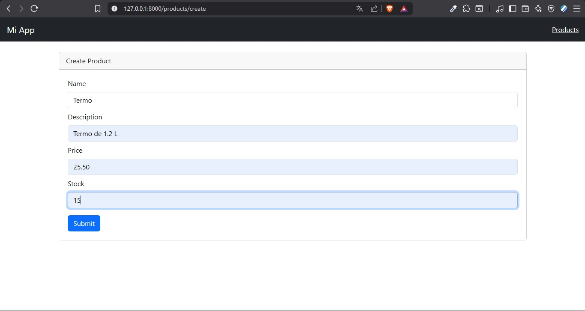
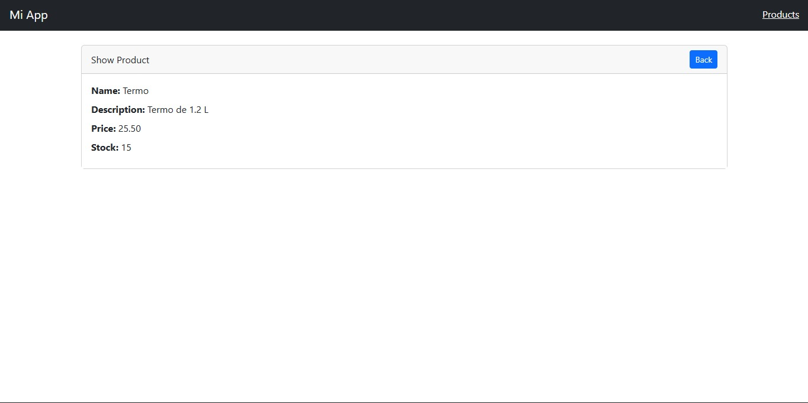
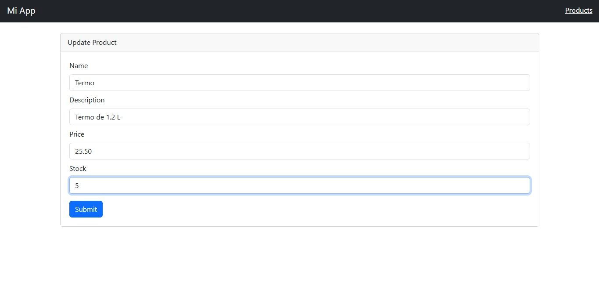
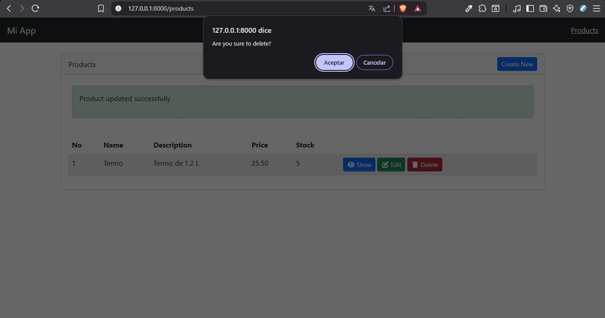

# 🛒 CRUD Rápido con Laravel
### Guía del Laboratorio #2 — Ing. Irina Fong


---

## 📋 Tabla de Contenidos

- [Descripción](#-descripción)
- [Requisitos Previos](#-requisitos-previos)
- [Paso 1 — Crear el Proyecto Laravel](#-paso-1--crear-el-proyecto-laravel)
- [Paso 2 — Configurar la Base de Datos](#-paso-2--configurar-la-base-de-datos)
- [Paso 3 — Ejecutar Migraciones Iniciales](#-paso-3--ejecutar-migraciones-iniciales)
- [Paso 4 — Crear el Modelo y Migración de Products](#-paso-4--crear-el-modelo-y-migración-de-products)
- [Paso 5 — Editar la Migración](#-paso-5--editar-la-migración)
- [Paso 6 — Editar el Modelo Product](#-paso-6--editar-el-modelo-product)
- [Paso 7 — Instalar el Generador de CRUD](#-paso-7--instalar-el-generador-de-crud)
- [Paso 8 — Publicar y Generar el CRUD](#-paso-8--publicar-y-generar-el-crud)
- [Paso 9 — Registrar la Ruta](#-paso-9--registrar-la-ruta)
- [Paso 10 — Crear el Layout para las Vistas](#-paso-10--crear-el-layout-para-las-vistas)
- [Paso 11 — Actualizar las Vistas del CRUD](#-paso-11--actualizar-las-vistas-del-crud)
- [Paso 12 — Correr el Servidor](#-paso-12--correr-el-servidor)
- [Galería de Capturas](#-galería-de-capturas)
- [Estructura del Proyecto](#-estructura-del-proyecto)
- [⚠️ Errores y Complicaciones](#️-errores-y-complicaciones-encontradas)

---

## 📖 Descripción

Este proyecto es un CRUD (Create, Read, Update, Delete) básico construido con **Laravel 13** y el starter kit de **Livewire + Flux**. Incluye autenticación completa con login/registro y gestión de productos con los campos: descripción, precio y stock.

---

## ✅ Requisitos Previos

Antes de comenzar, asegúrate de tener instalado:

| Herramienta | Versión Recomendada |
|-------------|-------------------|
| PHP | 8.4+ |
| Composer | 2.x |
| Node.js | 24.x |
| npm | incluido con Node.js |
| WAMP / XAMPP | Cualquier versión reciente |
| MySQL | 5.7+ |

---

## 🚀 Paso 1 — Crear el Proyecto Laravel

Desde la carpeta de tu servidor local (`C:\wamp64\www`), ejecuta en **CMD**:

```bash
cd C:\wamp64\www
laravel new CrudLaravel
```

Durante la instalación, responde las preguntas así:

```
Which starter kit? → livewire
Which authentication provider? → laravel
Single-file Livewire components? → no
Testing framework? → Pest
Install Laravel Boost? → no
Run npm install and npm run build? → yes
```

---

## 🗄️ Paso 2 — Configurar la Base de Datos

Entra al proyecto y abre el archivo **`.env`** en Visual Studio Code:

```bash
cd CrudLaravel
```

Edita estas líneas en `.env`:

```env
DB_CONNECTION=mysql
DB_HOST=127.0.0.1
DB_PORT=3306
DB_DATABASE=crudlaravelbd
DB_USERNAME=root
DB_PASSWORD=
```

> ⚠️ Asegúrate de haber creado la base de datos `crudlaravelbd` en **phpMyAdmin** o en tu cliente MySQL antes de continuar.

---

## ⚙️ Paso 3 — Ejecutar Migraciones Iniciales

En **PowerShell** o terminal dentro del proyecto:

```bash
php artisan migrate
```

Esto crea las tablas base: `users`, `cache`, `jobs` y columnas de two-factor.

---

## 🏗️ Paso 4 — Crear el Modelo y Migración de Products

```bash
php artisan make:model Product -m
```

Esto genera dos archivos:
- `app/Models/Product.php`
- `database/migrations/xxxx_create_products_table.php`

---

## 📝 Paso 5 — Editar la Migración

Abre el archivo de migración en `database/migrations/` y edita la función `up()`:

```php
public function up(): void
{
    Schema::create('products', function (Blueprint $table) {
        $table->id();
        $table->string('description');
        $table->double('price', 8, 2);  // 8 dígitos, 2 decimales
        $table->integer('stock');
        $table->timestamps();
    });
}
```

Luego corre la migración:

```bash
php artisan migrate
```

---

## 🔒 Paso 6 — Editar el Modelo Product

Abre `app/Models/Product.php` y agrega el array `$fillable` para proteger contra asignación masiva:

```php
<?php

namespace App\Models;

use Illuminate\Database\Eloquent\Model;

class Product extends Model
{
    protected $fillable = [
        'description',
        'price',
        'stock',
    ];
}
```

> **¿Por qué `$fillable`?** Especifica qué campos pueden asignarse masivamente con `create()` o `update()`, protegiendo campos sensibles como `id`.

---

## 📦 Paso 7 — Instalar el Generador de CRUD

```bash
composer require ibex/crud-generator --dev
```

---

## ⚡ Paso 8 — Publicar y Generar el CRUD

**Publicar archivos del paquete:**

```bash
php artisan vendor:publish --tag=crud
```

**Generar el CRUD para la tabla `products`:**

```bash
php artisan make:crud products
```

Cuando pregunte el stack, selecciona:

```
❯ bootstrap   (Blade with Bootstrap css)
```

Si pregunta si deseas sobrescribir el modelo, responde `y`.

Este comando genera automáticamente:
- ✅ `ProductController` con todos los métodos CRUD
- ✅ Vistas: `index`, `create`, `edit`, `show`
- ✅ Form Requests para validación

Actualiza el autoload:

```bash
composer dump-autoload
```

---

## 🗺️ Paso 9 — Registrar la Ruta

Abre `routes/web.php` y agrega:

```php
use App\Http\Controllers\ProductController;

Route::middleware(['auth'])->group(function () {
    Route::resource('products', ProductController::class);
});
```

Verifica que las rutas estén registradas:

```bash
php artisan route:list
```

Deberías ver todas las rutas de products:

```
GET|HEAD   products            products.index   → ProductController@index
POST       products            products.store   → ProductController@store
GET|HEAD   products/create     products.create  → ProductController@create
GET|HEAD   products/{product}  products.show    → ProductController@show
PUT|PATCH  products/{product}  products.update  → ProductController@update
DELETE     products/{product}  products.destroy → ProductController@destroy
GET|HEAD   products/{product}/edit products.edit → ProductController@edit
```

---

## 🎨 Paso 10 — Crear el Layout para las Vistas

El proyecto usa Livewire + Flux, que es incompatible con el sistema `@extends/@section` que genera el CRUD. La solución es crear un layout dedicado.

Crea el archivo `resources/views/layouts/crud.blade.php`:

```html
<!DOCTYPE html>
<html lang="es">
<head>
    <meta charset="UTF-8">
    <meta name="viewport" content="width=device-width, initial-scale=1.0">
    <title>@yield('template_title', 'CrudLaravel')</title>
    <link rel="stylesheet" href="https://cdn.jsdelivr.net/npm/bootstrap@5.3.0/dist/css/bootstrap.min.css">
    <link rel="stylesheet" href="https://cdnjs.cloudflare.com/ajax/libs/font-awesome/6.4.0/css/all.min.css">
</head>
<body>
    <nav class="navbar navbar-dark bg-dark px-4 mb-4">
        <a class="navbar-brand fw-bold" href="/">🛒 CrudLaravel</a>
        <a href="/products" class="text-white text-decoration-none">Productos</a>
    </nav>

    <div class="container">
        @yield('content')
    </div>

    <script src="https://cdn.jsdelivr.net/npm/bootstrap@5.3.0/dist/js/bootstrap.bundle.min.js"></script>
</body>
</html>
```

---

## 🖼️ Paso 11 — Actualizar las Vistas del CRUD

En los 4 archivos dentro de `resources/views/products/`, cambia la primera línea:

**Antes:**
```php
@extends('layouts.app')
```

**Después:**
```php
@extends('layouts.crud')
```

Los archivos a modificar son:
- `resources/views/products/index.blade.php`
- `resources/views/products/create.blade.php`
- `resources/views/products/edit.blade.php`
- `resources/views/products/show.blade.php`

---

## ▶️ Paso 12 — Correr el Servidor

```bash
php artisan serve
```

O usando el comando completo con Vite:

```bash
composer run dev
```

Abre tu navegador en:

```
http://127.0.0.1:8000/products
```

> Si no has iniciado sesión, serás redirigido al login automáticamente.

---

## 📸 Galería de Capturas

### ➕ Crear Producto
<!-- Agrega aquí tu captura del formulario de creación -->



---

### 👁️ Ver Producto (Show)
<!-- Agrega aquí tu captura del detalle del producto -->



---

### ✏️ Editar Producto
<!-- Agrega aquí tu captura del formulario de edición -->



---

### 🗑️ Eliminar Producto (Delete)
<!-- Agrega aquí tu captura de la confirmación de eliminación -->



---

## 📁 Estructura del Proyecto

```
CrudLaravel/
├── app/
│   ├── Http/
│   │   ├── Controllers/
│   │   │   └── ProductController.php   ← Controlador CRUD generado
│   │   └── Requests/
│   │       ├── StoreProductRequest.php
│   │       └── UpdateProductRequest.php
│   └── Models/
│       └── Product.php                 ← Modelo con $fillable
├── database/
│   └── migrations/
│       └── xxxx_create_products_table.php
├── resources/
│   └── views/
│       ├── layouts/
│       │   ├── app.blade.php           ← Layout Livewire/Flux (login)
│       │   └── crud.blade.php          ← Layout Bootstrap (CRUD)
│       └── products/
│           ├── index.blade.php
│           ├── create.blade.php
│           ├── edit.blade.php
│           └── show.blade.php
├── routes/
│   └── web.php                         ← Rutas registradas
└── .env                                ← Configuración de BD
```

---

## 🛠️ Comandos Resumen

```bash
# Crear proyecto
laravel new CrudLaravel

# Migraciones
php artisan migrate

# Modelo + migración
php artisan make:model Product -m

# Instalar generador
composer require ibex/crud-generator --dev

# Publicar archivos
php artisan vendor:publish --tag=crud

# Generar CRUD
php artisan make:crud products

# Actualizar autoload
composer dump-autoload

# Ver rutas
php artisan route:list

# Correr servidor
php artisan serve
```

---

<div align="center">
  <p>Hecho con ❤️ para el Laboratorio #2</p>
  <p><strong>Curso de Desarrollo Web con Laravel</strong></p>
</div>

---

## ⚠️ Errores y Complicaciones Encontradas

Durante el desarrollo de este laboratorio se presentaron los siguientes problemas. Se documentan aquí para que sirvan de referencia y no volver a caer en los mismos errores.

---

### 🔴 Error 1 — `Undefined variable $slot` (Internal Server Error 500)

**¿Cuándo ocurrió?**
Al intentar entrar a `http://127.0.0.1:8000/products` por primera vez después de generar el CRUD.

**Mensaje de error:**
```
ErrorException
resources\views\layouts\app.blade.php:3
Undefined variable $slot
```

**¿Por qué pasó?**
El generador `ibex/crud-generator` crea vistas que usan el sistema clásico de Laravel con `@extends('layouts.app')` y `@section('content')`. Sin embargo, este proyecto fue instalado con el starter kit de **Livewire + Flux**, cuyo `app.blade.php` usa el sistema moderno de **componentes Blade** con `{{ $slot }}`. Ambos sistemas son incompatibles entre sí.

El archivo `resources/views/layouts/app.blade.php` tenía:
```php
<x-layouts::app.sidebar :title="$title ?? null">
    <flux:main>
        {{ $slot }}   ← Espera un componente, no un @section
    </flux:main>
</x-layouts::app.sidebar>
```

Pero las vistas del CRUD hacían:
```php
@extends('layouts.app')   ← Sistema antiguo, incompatible
@section('content')
    ...
@endsection
```

**✅ Solución:**
Crear un layout separado `resources/views/layouts/crud.blade.php` con HTML clásico y Bootstrap, y luego cambiar en las 4 vistas del CRUD `@extends('layouts.app')` por `@extends('layouts.crud')`.

Ver detalles completos en el [Paso 10](#-paso-10--crear-el-layout-para-las-vistas) y [Paso 11](#️-paso-11--actualizar-las-vistas-del-crud).

---

### 🟡 Error 2 — La ruta `/products` no cargaba automáticamente

**¿Cuándo ocurrió?**
Al ejecutar `php artisan serve`, el servidor mostraba la URL `http://127.0.0.1:8000/` y se esperaba que el CRUD cargara solo.

**¿Por qué pasó?**
`php artisan serve` solo levanta el servidor en la URL raíz (`/`). Las rutas del CRUD son independientes y hay que navegarlas manualmente. No existe redirección automática hacia `/products` a menos que se configure explícitamente.

**✅ Solución:**
Escribir manualmente la URL completa en el navegador:
```
http://127.0.0.1:8000/products
```
> Si el middleware `auth` está activo, primero redirige al login y luego al CRUD.

---

### 💡 Lecciones Aprendidas

| # | Problema | Causa | Solución |
|---|----------|-------|----------|
| 1 | `Undefined variable $slot` | Incompatibilidad entre sistema de componentes Blade (Livewire/Flux) y sistema clásico `@extends/@section` | Crear `layouts/crud.blade.php` con Bootstrap y actualizar las 4 vistas |
| 2 | Ruta no carga automáticamente | `php artisan serve` solo levanta el servidor, no redirige rutas | Navegar manualmente a `http://127.0.0.1:8000/products` |

---

## 🛠️ Comandos Resumen
